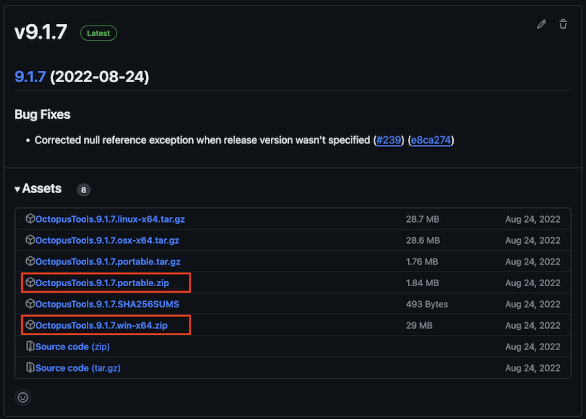

This plug-in allows TeamCity builds to trigger deployments in Octopus Deploy.

## Get the plugin

Download the plugin from [the Octopus Deploy downloads page](http://octopusdeploy.com/downloads) or
the [JetBrains plugins downloads](<https://plugins.jetbrains.com/plugin/9038-octopus-deploy>).

Installation and usage instructions are available
in [the Octopus Deploy documentation](http://octopusdeploy.com/documentation/integration/teamcity).

## Building

To build the plugin from code:

1. Install the latest version of the JDK (plugin is build/runnable in Java-8 and above)
2. Install TeamCity
4. Run `gradlew clean distZip`  
   The `gradlew` script will download Gradle for you if it is not already installed.
5. The plugin is available at `build/distributions/Octopus.TeamCity.<X.Y.Z>.zip` (where X.Y.Z is the
   SemVer of the release, potentially including 'SNAPSHOT').

## Editing and debugging in IntelliJ

1. Set the following environment variables to enable debug into Server/Agent and also enable
   "devMode" in the server, which expedites development by allowing 'hot-reload' of both plugins and
   Java Server Pages (JSP files). It also ensures the new Octopus Step Vnext is available
   (feature flagged).
    1. TEAMCITY_SERVER_OPTS=-Dteamcity.development.mode=true -agentlib:
       jdwp=transport=dt_socket,server=y,suspend=n,address=*:5011 -Denable.step.vnext=true
    1. TEAMCITY_AGENT_OPTS=-agentlib:jdwp=transport=dt_socket,server=y,suspend=n,address=5010
1. Install TeamCity locally to `C:\TeamCity`. Allow the service to start for the first time, and add
   an admin user. Then stop the service so it is not running.
1. Give yourself full permissions to the Teamcity Data folder (usually
   `C:\ProgramData\JetBrains\TeamCity`). This folder may be hidden.
1. Import the Gradle project into IntelliJ.
1. Two Run Configurations 'AttachToServer' and 'AttachToAgent' should already exist - and allow the
   IDE to connect to running, debug-enabled

Start a Teamcity server and agent manually, then install the built plugin via the administration->
plugins menu option.

You can then attach to the server/agent via the provided run-configurations, and step through the
plugin code when build steps are configured (on server) or executed (on agent).

## Build Server
The TeamCity Plugin uses Github actions for all CI/CD/Release operations.

## Updating the version of Octopus CLI we embed

#### Note that [OctopusCLI](https://github.com/OctopusDeploy/OctopusCLI/releases) has been deprecated in favour of the newer [CLI](https://github.com/OctopusDeploy/cli/tags) which is written in Go. Due to compatibility issues with the new CLI, this plugin should continue to use [OctopusCLI](https://github.com/OctopusDeploy/OctopusCLI/releases).

If the Octopus CLI has changed such that we need to update the version we embed with the plugin the
steps are as follows:

- Locate the latest release of the CLI on the [OctopusCLI repo](https://github.com/OctopusDeploy/OctopusCLI/releases)
- Download the `OctopusTools.[version].win-x64.zip` package and extract the `octo.exe` from it
- Also download the `OctopusTools.[version].portable.zip` file
  
- Rename the latter to `OctopusTools.portable.zip` and then copy them into
  the `\octopus-agent\src\main\resources\resources\3\0` folder, over the existing files

## Using Docker

Some docker files have been provided to assist development for users who may not have all the
prerequisite tooling available on their local machine for development. This process will currently
be slower and does not provide the benefits of debugging at this point in time.

1. Run `docker-compose -f docker-compose.teamcity.yml up -d` to allow the TeamCity server and agent
   spin up. This will take some time to initialize and will store the configuration files
   under `./docker-files`. This will allow for both restarting the server without the full
   initialization and to pass in the Octopus plugin.
2. Once the server has started navigate, to the instance via http://localhost:8111 and create an
   admin login (this setup only needs to take place once due to the configuration mount). Once the
   server starts up, navigate to `Agents`->`Unauthorized` and authorise the agent that was started
   in a container alongside the server.
3. Build the plugin by running `docker-compose -f docker-compose.build.yml up`. This will use a
   gradle image, mount the current directory and invoke the `gradlew` command described above. At
   the end of the build the plugin will be copied into the TeamCity plugins directory created by the
   container in the previous step.
4. Once the plugin has been built, you will need to restart the server by running (depending on your
   environment) `docker restart octopus-teamcity_teamcity-server_1`.
5. When testing with a connection to an Octopus Server instance on your local host instance, you can
   use the special `host.docker.internal` route. e.g. http://host.docker.internal:8065

## End-2-End Tests

The e2e suite spins up real TeamCity + agent + free-tier Octopus + MSSQL containers via
Testcontainers (Docker). To run it:

```sh
./gradlew :e2e:playwrightInstall   # once — only for the Playwright UI tests
./gradlew :e2e:e2eTest             # run the suite (add --tests "*SomeTest" for one)
```

On macOS/Windows, run it inside the provided Linux container instead so the Playwright UI tests
work:

```sh
docker compose -f e2e/docker-compose.yml up --abort-on-container-exit --exit-code-from e2e
```

See [docs/e2e-tests.md](docs/e2e-tests.md) for prerequisites, the `TEAMCITY_PLUGIN_DIST` and
`GRADLE_TESTS` options, how to add a test, and interactive manual testing.

## Connection API key sources

An Octopus connection can supply credentials three ways, chosen by the **API key source** field:

- **Enter an API key** (default) — a stored secret API key, as before.
- **Reference a parameter** — a single parameter reference such as `%octopus.apikey%`. Keep the
  secret in that TeamCity parameter; the connection just points at it.
- **Use an OIDC token** — It the Octopus [TeamCity OIDC plugin](https://github.com/OctopusDeploy/teamcity-oidc-plugin) 
  is installed, you can reference an *OIDC Identity Token* connector. The connector's audience is the 
  Octopus service account id; the token is taken from the connector's token variable (default `%jwt.token%`). 
  This option appears only when an OIDC connector exists in the project.

Note: Choosing OIDC switches the step to the new Octopus CLI — the legacy `octo` CLI does not support
OIDC. The OIDC token is short-lived (the JWT lifetime defaults to ~10 minutes): the CLI logs in once
and reuses the session, so a single long-running deploy-with-wait that outlives the token may fail
when it expires. OIDC is not available for the **Promote release** step, as the new Octopus CLI does not
currently support promote-from; use an API key or parameter source there, or promote via a Deploy
release step.

## Versioning, Releasing and Publishing

The version is computed from git, and releases are cut by
[release-please](https://github.com/googleapis/release-please) from [Conventional Commit](https://www.conventionalcommits.org)
messages.

### Versioning
The plugin version for a build is computed by [GitVersion](https://gitversion.net) (`GitVersion.yml`,
`mode: ContinuousDeployment`) and passed to Gradle as `-Pversion=<computed>`: pull-request builds get
a pre-release version (e.g. `6.3.1-PullRequest0192.31`) and release builds get the tagged version.
The `version` in `gradle.properties` is the fallback for local builds (`./gradlew distZip` with no
`-Pversion`).

### Releasing
Releases are driven by Conventional Commit messages and the `release-please` workflow
(`.github/workflows/release.yml`, run on each push to `main`):

1. Land changes on `main` via PRs with Conventional Commit messages: `fix:` bumps the patch, `feat:`
   the minor, and `!`/`BREAKING CHANGE:` the major (`docs:`, `style:`, `test:`, `chore:` don't bump
   the version).
1. release-please maintains a **release PR** that bumps the version and updates `CHANGELOG.md`.
1. Merging the release PR creates the git tag (`vX.Y.Z`) and the GitHub Release.

### Publishing
Publishing the GitHub Release triggers the build workflow (`.github/workflows/main.yml`, on
`release: [published]`), which builds and tests at the release version and creates a release in
Octopus Deploy.

The package reaches the JetBrains Marketplace via [Octopus Deploy](https://deploy.octopus.app):
promoting the [TeamCity Plugin](https://deploy.octopus.app/app#/Spaces-62/projects/teamcity-plugin/deployments)
from "Components - Internal" to "Components - External" runs a script that pushes the package to
JetBrains.
